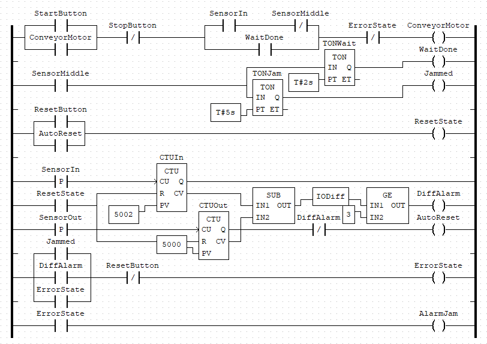

# Automated Assembly Line Control System

An industrial conveyor control system implemented in IEC 61131-3 Ladder Logic using OpenPLC. Models a three-station assembly line with a timed processing halt at the middle station, dual-layer fault detection, and continuous self-resetting operation.



---

## System Overview

Three sensors track each part through the line. The middle station halts the conveyor for a timed processing cycle — welding, inspection, labeling, or any fixed-duration operation. Two independent fault detection mechanisms monitor for jams and abnormal accumulation. The system runs continuously and resets itself with no operator input under normal conditions.

```
[SensorIn] ──── conveyor ──── [SensorMiddle / Process T#2s] ──── [SensorOut]
   count++                          jam detection                   count++
```

---

## Variable Table

| # | Name | Class | Type | Description |
|---|------|-------|------|-------------|
| 1 | SensorIn | Input | BOOL | Detects incoming part |
| 2 | SensorMiddle | Input | BOOL | Processing station presence |
| 3 | SensorOut | Input | BOOL | Exit confirmation |
| 4 | StartButton | Input | BOOL | System start |
| 5 | StopButton | Input | BOOL | System stop |
| 6 | ResetButton | Input | BOOL | Manual fault reset |
| 7 | ConveyorMotor | Output | BOOL | Main drive motor |
| 8 | AlarmJam | Output | BOOL | Fault indicator |
| 9 | TONWait | Local | TON | Processing timer (T#2s) |
| 10 | TONJam | Local | TON | Jam detection timer (T#5s) |
| 11 | CTUIn | Local | CTU | Incoming part counter (PV=5002) |
| 12 | CTUOut | Local | CTU | Outgoing part counter (PV=5000) |
| 13 | WaitDone | Local | BOOL | Processing cycle complete flag |
| 14 | Jammed | Local | BOOL | TONJam output latch |
| 15 | ErrorState | Local | BOOL | System fault latch |
| 16 | IODiff | Local | INT | CTUIn.CV − CTUOut.CV |
| 17 | DiffAlarm | Local | BOOL | IODiff ≥ 3 flag |
| 18 | AutoReset | Local | BOOL | Automatic counter reset trigger |
| 19 | ResetState | Local | BOOL | Unified reset signal |

---

## Ladder Logic — Rung Descriptions

**Rung 1 — Motor Control**
```
(StartButton OR ConveyorMotor) AND /StopButton AND (SensorIn OR WaitDone)
AND /SensorMiddle AND /ErrorState → ConveyorMotor
```
Seal-in latch with start/stop logic. Motor holds on its own contact after start. SensorMiddle NC contact halts the belt when a part arrives at the processing station. WaitDone bypasses SensorMiddle after the processing cycle completes so the part can exit.

**Rung 2 — Processing Timer (TONWait)**
```
SensorMiddle → TONWait [PT = T#2s] → WaitDone
```
Starts counting when a part reaches the processing station. WaitDone goes TRUE after 2 seconds, releasing the motor.

**Rung 3 — Jam Timer (TONJam)**
```
SensorMiddle → TONJam [PT = T#5s] → Jammed
```
If SensorMiddle stays active beyond 5 seconds, the part has not cleared the station — jam detected.

**Rung 4 — Counters and Difference Logic**
```
SensorIn (P)  → CTUIn  [PV=5002, R=ResetState]
SensorOut (P) → CTUOut [PV=5000, R=ResetState]
CTUIn.CV − CTUOut.CV → IODiff    (SUB block)
IODiff ≥ 3            → DiffAlarm (GE block)
CTUOut.Q AND /DiffAlarm → AutoReset
```
Counts every part entering and exiting. Computes the live in/out difference each scan. If 3 or more parts are on the line simultaneously, DiffAlarm fires. CTUOut reaching PV triggers AutoReset only when the line is balanced.

**Rung 5 — Fault Latch (ErrorState)**
```
(Jammed OR DiffAlarm OR ErrorState) AND /ResetButton → ErrorState
```
Latches on any fault condition. Requires manual ResetButton to clear — operator acknowledgment is mandatory before restart.

**Rung 6 — Reset Logic**
```
AutoReset OR ResetButton → ResetState
```
ResetState feeds both CTU reset pins. ResetButton also directly clears ErrorState.

**Rung 7 — Alarm Output**
```
ErrorState → AlarmJam
```

---

## Fault Detection Logic

### Layer 1 — TONJam (time-based)
A part remaining at the processing station beyond 5 seconds triggers a jam. Catches mechanical blockages at the station level.

### Layer 2 — IODiff (count-based)
Every scan computes `IODiff = CTUIn.CV − CTUOut.CV`. If the difference reaches 3, parts are accumulating faster than they exit — catches inter-station jams that TONJam cannot see.

Both layers drive ErrorState. The motor stops and AlarmJam activates until an operator resets.

---

## Automatic Reset Mechanism

CTUOut PV=5000, CTUIn PV=5002. When CTUOut reaches 5000:
- `DiffAlarm = 0` (line is balanced) → AutoReset fires → both counters clear simultaneously
- `DiffAlarm = 1` (parts unaccounted for) → reset blocked, fault path takes over

The PV asymmetry ensures CTUOut always triggers first. Both counters reset in the same scan cycle — IODiff is preserved across the boundary.

---

## Tools

- [OpenPLC Editor](https://autonomylogic.com/) — IEC 61131-3 Ladder Logic IDE
- IEC 61131-3 Function Blocks: TON, CTU, SUB, GE
